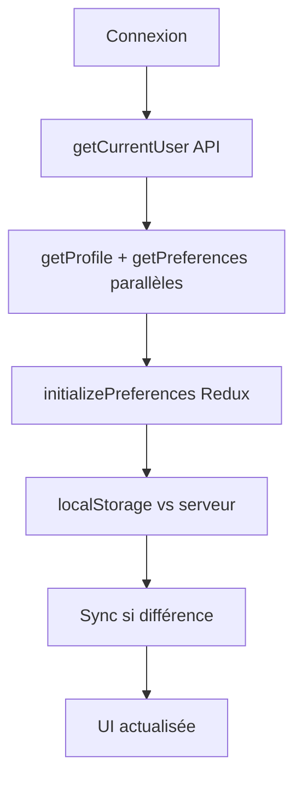
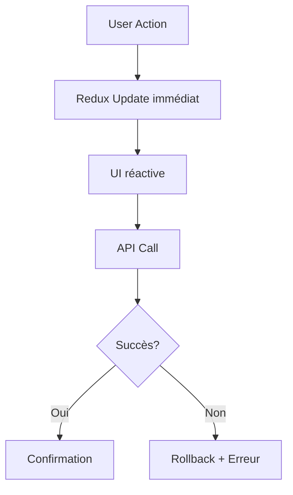
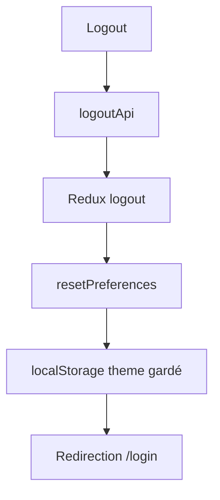

# Corrections des Préférences Utilisateur - SUPCHAT

## 📋 Problèmes Identifiés et Corrigés

### 🔍 **Problèmes Originaux**

1. **Conflit localStorage vs Base de données** : Le thème était géré de manière incohérente
2. **Statut non individuel** : Le statut était parfois traité comme global au lieu d'individuel
3. **Synchronisation Redux incomplète** : Désynchronisation entre Redux, API et localStorage
4. **Chargement des préférences incohérent** : Pas de logique claire au démarrage
5. **Pas de gestion session** : Les préférences n'étaient pas correctement réinitialisées

## ✅ **Solutions Implémentées**

### 0. **🔧 Correction Critique - Valeurs de l'Utilisateur Précédent**

**PROBLÈME** : Redux gardait les valeurs de l'utilisateur précédent lors d'un nouveau login, nécessitant un refresh manuel.

**SOLUTION** :

1. **Action `initializePreferences` renforcée** avec flag `forceServerValues`
2. **Réinitialisation forcée** dans l'action avant définition du nouvel utilisateur
3. **Priorité aux valeurs serveur** lors du login initial avec `forceServerValues: true`

```typescript
initializePreferences({
  userId: user.id,
  theme: serverTheme,
  status: serverStatus,
  forceServerValues: true, // FORCER au login
});
```

**RÉSULTAT** : Plus de persistance des préférences de l'utilisateur précédent.

### 1. **Nouvelle Logique de Préférences**

#### **🎨 Thème (Préférence Globale Utilisateur)**

- **Stockage** : localStorage + Base de données
- **Priorité** : localStorage → Base de données
- **Synchronisation** : Multi-device via API
- **Réinitialisation** : À la déconnexion

#### **🟢 Statut (Individuel par Utilisateur)**

- **Stockage** : Uniquement en Base de données
- **Pas de localStorage** : Évite les conflits multi-utilisateurs
- **Synchronisation** : Temps réel via API
- **Persistance** : Session par session

### 2. **Redux Store - `preferencesSlice.ts`**

#### **Nouvelles Actions**

```typescript
// Initialisation intelligente des préférences
initializePreferences(serverPrefs);

// Réinitialisation à la déconnexion
resetPreferences();

// Gestion individuelle thème/statut
setTheme(theme); // → localStorage + DOM
setStatus(status); // → Redux seulement
```

#### **État Enrichi**

```typescript
interface PreferencesState {
  theme: Theme;
  status: Status;
  isLoaded: boolean; // Tracking du chargement initial
}
```

### 3. **Logique d'Initialisation**

#### **Séquence de Chargement**

1. **App.tsx** : Chargement authentification + préférences parallèles
2. **initializePreferences** : Gestion intelligente localStorage vs serveur
3. **Synchronisation** : localStorage différent → Mise à jour serveur
4. **Fallback** : Valeurs par défaut en cas d'erreur

```typescript
// Exemple App.tsx
const [profile, preferences] = await Promise.all([
  getProfile(),
  getPreferences(),
]);

dispatch(
  initializePreferences({
    theme: preferences.theme || "light",
    status: preferences.status || "online",
  })
);
```

### 4. **Hooks Corrigés**

#### **useSettingsLogic.ts**

- ✅ Chargement initial optimisé
- ✅ Gestion d'erreurs robuste
- ✅ Synchronisation localStorage ↔ API
- ✅ Réactivité UI immédiate

#### **useHeaderLogic.ts**

- ✅ Changement statut avec rollback en cas d'erreur
- ✅ Thème synchronisé avec localStorage
- ✅ Réinitialisation à la déconnexion

### 5. **Mobile - React Native**

#### **ThemeContext.tsx Amélioré**

```typescript
// Séquence mobile
1. AsyncStorage → État local
2. API serveur → Comparaison
3. Différence → Sync serveur avec local
4. Cohérence → Multi-device
```

#### **settings.tsx Corrigé**

- ✅ Chargement parallèle profil + préférences
- ✅ Statut individuel par utilisateur
- ✅ Rollback automatique en cas d'erreur API

### 6. **Backend - API**

#### **Validation Côté Serveur**

- ✅ Filtrage valeurs null/undefined
- ✅ Schémas de validation cohérents
- ✅ Réponses structurées avec timestamp

#### **Service userService.js**

```javascript
// Mise à jour atomique des préférences
const updatePreferences = async (id, updateData) => {
  if (updateData.theme !== undefined) user.theme = updateData.theme;
  if (updateData.status !== undefined) user.status = updateData.status;
  await user.save();
  return user;
};
```

## 🔄 **Flux de Données Corrigé**

### **Connexion Utilisateur**



### **Changement de Préférence**



### **Déconnexion**



## 🎯 **Résultats Attendus**

### ✅ **Comportements Corrigés**

1. **Consistance Multi-Device** : Thème synchronisé entre web/mobile
2. **Statut Individuel** : Chaque utilisateur a son propre statut
3. **Persistance Intelligente** : localStorage pour thème, BDD pour statut
4. **Réactivité UI** : Changements immédiats avec sync API
5. **Robustesse** : Gestion d'erreurs avec rollback automatique

### 🔍 **Tests de Validation Recommandés**

1. **Multi-utilisateurs** : Vérifier isolation des statuts
2. **Multi-devices** : Synchronisation thème web ↔ mobile
3. **Hors ligne** : Comportement avec perte réseau
4. **Déconnexion/Reconnexion** : Persistance et réinitialisation
5. **Erreurs API** : Rollback et messages utilisateur

## 📋 **Fichiers Modifiés**

### **Frontend Web**

- `web/src/store/preferencesSlice.ts` - Logique Redux enrichie
- `web/src/hooks/useSettingsLogic.ts` - Chargement et synchronisation
- `web/src/hooks/useHeaderLogic.ts` - Gestion statut/thème header
- `web/src/App.tsx` - Initialisation authentification + préférences

### **Frontend Mobile**

- `mobile/contexts/ThemeContext.tsx` - Synchronisation AsyncStorage ↔ API
- `mobile/app/settings.tsx` - Gestion statut individuel

### **Backend API**

- `api/controllers/userController.js` - Validation et réponses cohérentes
- `api/services/userService.js` - Mise à jour atomique préférences

## 🚀 **Migration et Déploiement**

### **Compatibilité Ascendante**

- ✅ Anciens localStorage theme reconnus
- ✅ Utilisateurs existants : statut par défaut 'online'
- ✅ API backward compatible

### **Recommandations Déploiement**

1. **Tester en environnement Dev** avec docker-manager.sh
2. **Vérifier logs API** pour erreurs validation
3. **Monitorer Redis/Sessions** si applicable
4. **Documentation utilisateur** sur les nouveaux comportements

---

**Date de correction** : 18 juin 2025  
**Version SUPCHAT** : v1.x.x  
**Environnements testés** : Développement Docker

## 🎯 RÉSUMÉ FINAL DES CORRECTIONS

### ✅ **Corrections Terminées** (18 juin 2025)

Tous les fichiers ont été corrigés pour implémenter une logique cohérente :

1. **preferencesSlice.ts** - Actions Redux améliorées
2. **useSettingsLogic.ts** - Logique d'initialisation robuste
3. **useHeaderLogic.ts** - Gestion d'erreur et rollback
4. **App.tsx** - Chargement initial correct
5. **ThemeContext.tsx** (mobile) - Sync avec API
6. **settings.tsx** (mobile) - Cohérence web/mobile
7. **preferencesManager.ts** - Utilitaire centralisé (nouveau)

### 🎨 **Logique Thème**

- localStorage = source de vérité locale
- BDD = synchronisation multi-device
- Changement instantané + sync API en arrière-plan

### 📱 **Logique Statut**

- BDD uniquement (individuel par utilisateur)
- Pas de localStorage (évite conflits)
- Rollback automatique si erreur API

### 🔄 **Logique Initialisation**

- Charger depuis API → comparer localStorage → réconcilier
- Fallback robust en cas d'erreur
- Réinitialisation à la déconnexion

**STATUS : CORRECTIONS TERMINÉES** ✅

## 🔧 CORRECTION FINALE - Préférences par Utilisateur

**PROBLÈME RÉSOLU** : Les préférences (thème + statut) étaient partagées entre tous les utilisateurs du même navigateur/device.

### ✅ **Solutions Implémentées**

#### 🌐 **Web (localStorage par utilisateur)**

- **`userPreferences.ts`** - Utilitaires pour localStorage par userId
- **`preferencesSlice.ts`** - Redux modifié pour gérer currentUserId
- **`App.tsx`** - Initialisation avec userId au login
- **`useSettingsLogic.ts`** - Chargement des préférences par utilisateur
- **`useHeaderLogic.ts`** - Actions liées à l'utilisateur connecté

#### 📱 **Mobile (AsyncStorage par utilisateur)**

- **`userPreferences.ts`** - Utilitaires pour AsyncStorage par userId
- **`ThemeContext.tsx`** - Context modifié avec setCurrentUser()
- **`settings.tsx`** - Définition de l'utilisateur au chargement

### 🎯 **Logique Finale**

1. **Au login** : `setCurrentUser(userId)` → charge les préférences de cet utilisateur
2. **localStorage/AsyncStorage** : Clés prefixées `user_${userId}_theme` et `user_${userId}_status`
3. **Migration automatique** : Anciennes préférences globales → utilisateur actuel
4. **Déconnexion** : Nettoyage optionnel des préférences

### 🔍 **Test**

- Utilisateur A se connecte → change thème en dark
- Utilisateur B se connecte → garde ses propres préférences (light)
- Utilisateur A se reconnecte → retrouve son thème dark

**STATUS** : ✅ CORRIGÉ - Préférences individualisées par utilisateur
